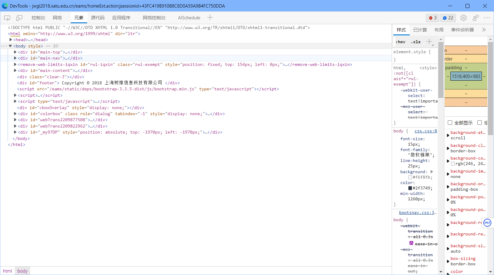
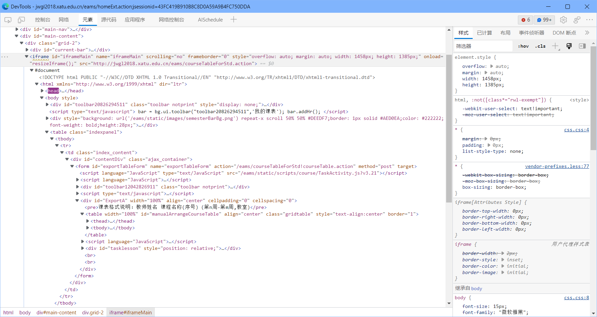
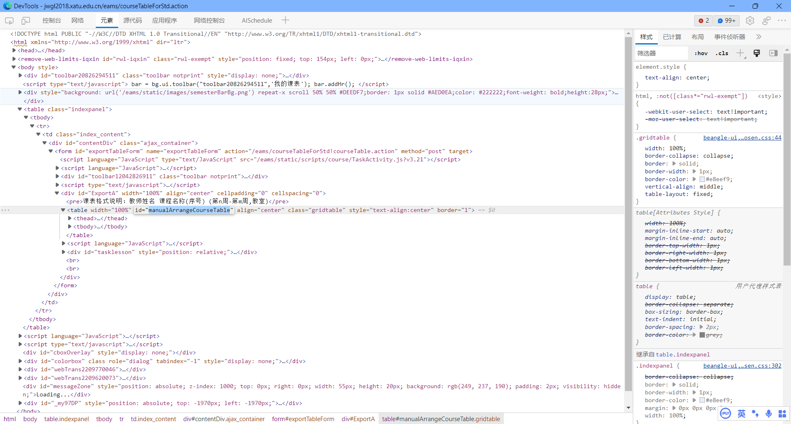

# 西安工业大学适配记录

- 接单时间：2022/09/28
- 平台：闲鱼
- 单价：￥8
- 系统：树维


## 一、获取基本信息

- 教务处网址（来自卖家）：

  > jwgl2018.xatu.edu.cn/eams/homeExt.action;jsessionid=43FC419B910B8C8D0A59A9B4FC750DDA

打开后按照买家提供的  ` 账号 `  与 `密码` 进入，打开 `浏览器开发者工具` ，如图：



易知：该教务系统为 `树维` 。

向像大佬求 `树维` 模板无果后由开始自己独立适配


## 二、确定课表页面

点开 `我的课表` 查看页面结构，发现课表是通过 <iframe> 标签镶嵌在在页面里。

由此可得真实课表连接为：http://jwgl2018.xatu.edu.cn/eams/courseTableForStd.action



在 **AISchedule** 开发工具登陆并创建相关项目，填写真实课表链接。


## 三、编写scheduleHtmlProvider

观察页面结构，课表数据位于 **id** 为  **manualArrangeCourseTable** 的 <table> 标签内



于是，直接通过getById的方法获取并返回即可。

```javascript
function scheduleHtmlProvider() {
    return document.getElementById('manualArrangeCourseTable').outerHTML
}
```

